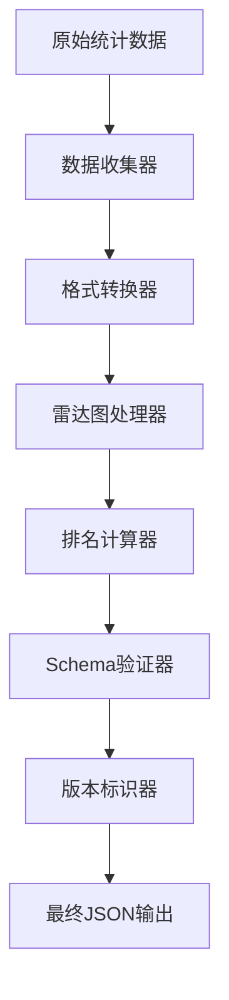

# JSON数据结构系统 - 技术分析文档

## 概述

JSON数据结构系统是整个教育统计分析平台的最终数据输出层，负责将所有已完成的统计计算结果（Issues #2-10）整合成标准化的JSON格式，为前端雷达图和数据可视化提供友好的数据接口。

## 1. 系统架构设计

### 1.1 整体架构

```
┌─────────────────┐     ┌─────────────────┐     ┌─────────────────┐
│   统计计算结果   │────▶│  JSON序列化层   │────▶│   前端消费层    │
│  (Tasks #2-10)  │     │  (Task #11)     │     │   (雷达图等)    │
└─────────────────┘     └─────────────────┘     └─────────────────┘
```

### 1.2 核心组件架构

```python
app/services/serialization/
├── statistics_json_serializer.py    # 主序列化器
├── regional_data_serializer.py      # 区域级数据序列化
├── school_data_serializer.py        # 学校级数据序列化
├── radar_chart_formatter.py         # 雷达图数据格式化
├── version_manager.py              # 版本控制管理
└── schema_validator.py             # JSON Schema验证

app/schemas/json_schemas/
├── regional_statistics_schema.py   # 区域数据Schema
├── school_statistics_schema.py     # 学校数据Schema
└── radar_chart_schema.py          # 雷达图数据Schema
```

### 1.3 数据流转设计



## 2. 与json-data-specification.md规范的严格遵循

### 2.1 区域级数据结构遵循

基于json-data-specification.md第2.1节规范，实现完全兼容的数据结构：

```python
class RegionalDataSerializer:
    def serialize(self, batch_code: str, calculation_results: Dict) -> Dict:
        """严格按照规范序列化区域数据"""
        return {
            "batch_info": self._build_batch_info(batch_code),
            "academic_subjects": self._build_academic_subjects(calculation_results),
            "non_academic_subjects": self._build_non_academic_subjects(calculation_results),
            "radar_chart_data": self._build_radar_chart_data(calculation_results)
        }
```

**关键遵循点**：
- 所有分数保留1位小数 (85.2)
- 所有得分率保留3位小数 (0.852)  
- 所有百分比保留2位小数 (0.40)
- 维度得分率 = 维度平均分 / 维度总分
- 等级分布百分比之和 = 1.0

### 2.2 学校级数据结构遵循

基于json-data-specification.md第2.2节规范：

```python
class SchoolDataSerializer:
    def serialize(self, batch_code: str, school_id: str, 
                 school_results: Dict, regional_results: Dict) -> Dict:
        """序列化学校数据，包含区域对比"""
        return {
            "school_info": self._build_school_info(school_id),
            "academic_subjects": self._build_school_academic_subjects(
                school_results, regional_results
            ),
            "non_academic_subjects": self._build_school_non_academic_subjects(
                school_results, regional_results
            ),
            "radar_chart_data": self._build_school_radar_chart_data(
                school_results, regional_results
            )
        }
```

## 3. 前端雷达图数据格式设计

### 3.1 雷达图数据结构

基于前端ECharts雷达图组件需求，设计双层对比数据结构：

```python
class RadarChartFormatter:
    def format_regional_radar_data(self, dimensions_data: Dict) -> Dict:
        """区域级雷达图数据"""
        return {
            "academic_dimensions": [
                {
                    "dimension_name": "数学运算",
                    "score_rate": 0.8125,        # 区域得分率
                    "max_rate": 1.0              # 雷达图最大刻度
                }
            ],
            "non_academic_dimensions": [
                {
                    "dimension_name": "好奇心",
                    "score_rate": 0.82,
                    "max_rate": 1.0
                }
            ]
        }
    
    def format_school_radar_data(self, school_data: Dict, regional_data: Dict) -> Dict:
        """学校级雷达图数据（包含区域对比）"""
        return {
            "academic_dimensions": [
                {
                    "dimension_name": "数学运算",
                    "school_score_rate": 0.87,      # 学校得分率（内圈）
                    "regional_score_rate": 0.8125,  # 区域得分率（参考线）
                    "max_rate": 1.0
                }
            ],
            "non_academic_dimensions": [
                {
                    "dimension_name": "好奇心",
                    "school_score_rate": 0.848,
                    "regional_score_rate": 0.82,
                    "max_rate": 1.0
                }
            ]
        }
```

### 3.2 前端数据消费友好性设计

- **标准化字段命名**：遵循驼峰命名约定
- **完整的数据类型**：明确数值、字符串、数组类型
- **嵌套结构扁平化**：雷达图数据直接可用，无需深层遍历
- **差异数据突出**：学校vs区域对比数据并列展示

## 4. 与已完成任务的数据集成方案

### 4.1 数据源映射关系

```python
# 数据集成映射表
TASK_DATA_INTEGRATION = {
    # Task #4: 基础统计计算引擎
    "basic_statistics": {
        "source": "app.calculation.engine.CalculationEngine",
        "mapping": {
            "mean": "avg_score",
            "std": "std_dev", 
            "min": "min_score",
            "max": "max_score"
        }
    },
    
    # Task #5: 百分位数计算器
    "percentiles": {
        "source": "app.calculation.calculators.percentile_calculator",
        "mapping": {
            "P10": "percentiles.P10",
            "P50": "percentiles.P50", 
            "P90": "percentiles.P90"
        }
    },
    
    # Task #6: 区分度和难度计算
    "educational_metrics": {
        "source": "app.calculation.calculators.discrimination_calculator",
        "mapping": {
            "difficulty": "difficulty",
            "discrimination": "discrimination"
        }
    },
    
    # Task #7: 维度统计处理
    "dimensions": {
        "source": "app.calculation.calculators.dimension_calculator",
        "mapping": {
            "dimension_stats": "dimensions"
        }
    },
    
    # Task #8: 等级分布计算
    "grade_distribution": {
        "source": "app.calculation.calculators.grade_calculator",
        "mapping": {
            "grade_stats": "grade_distribution"
        }
    },
    
    # Task #9: 问卷数据处理
    "survey_data": {
        "source": "app.calculation.calculators.survey_calculator",
        "mapping": {
            "survey_dimensions": "non_academic_subjects",
            "option_distribution": "question_analysis"
        }
    },
    
    # Task #10: 任务管理API
    "task_metadata": {
        "source": "app.services.task_manager",
        "mapping": {
            "batch_code": "batch_info.batch_code",
            "calculation_time": "batch_info.calculation_time"
        }
    }
}
```

### 4.2 数据整合核心类

```python
class StatisticsDataIntegrator:
    """统计数据集成器"""
    
    def __init__(self):
        self.calculation_service = CalculationService()
        self.survey_calculator = SurveyCalculator() 
        self.task_manager = TaskManager()
        
    def collect_all_statistics(self, batch_code: str) -> Dict:
        """收集所有统计计算结果"""
        integrated_data = {}
        
        # 收集基础统计数据 (Task #4)
        basic_stats = self.calculation_service.get_basic_statistics(batch_code)
        integrated_data['basic_statistics'] = basic_stats
        
        # 收集百分位数据 (Task #5)
        percentiles = self.calculation_service.get_percentiles(batch_code)
        integrated_data['percentiles'] = percentiles
        
        # 收集教育指标 (Task #6)
        edu_metrics = self.calculation_service.get_educational_metrics(batch_code)
        integrated_data['educational_metrics'] = edu_metrics
        
        # 收集维度统计 (Task #7)
        dimensions = self.calculation_service.get_dimension_statistics(batch_code)
        integrated_data['dimensions'] = dimensions
        
        # 收集等级分布 (Task #8)
        grades = self.calculation_service.get_grade_distribution(batch_code)
        integrated_data['grade_distribution'] = grades
        
        # 收集问卷数据 (Task #9)
        survey_data = self.survey_calculator.get_survey_statistics(batch_code)
        integrated_data['survey_data'] = survey_data
        
        # 收集任务元数据 (Task #10)
        task_meta = self.task_manager.get_batch_metadata(batch_code)
        integrated_data['task_metadata'] = task_meta
        
        return integrated_data
```

## 5. 性能优化和版本管理策略

### 5.1 性能优化策略

#### 5.1.1 序列化性能优化

```python
class OptimizedJsonSerializer:
    """高性能JSON序列化器"""
    
    def __init__(self):
        self.cache = RedisCache()
        self.thread_pool = ThreadPoolExecutor(max_workers=4)
        
    def serialize_with_cache(self, batch_code: str, data_type: str) -> Dict:
        """带缓存的序列化"""
        cache_key = f"json_data:{batch_code}:{data_type}"
        
        # 先尝试从缓存获取
        cached_result = self.cache.get(cache_key)
        if cached_result:
            return cached_result
            
        # 执行序列化
        result = self._do_serialize(batch_code, data_type)
        
        # 缓存结果（1小时）
        self.cache.set(cache_key, result, expire=3600)
        
        return result
    
    def parallel_serialize(self, batch_code: str) -> Dict:
        """并行序列化多个数据类型"""
        futures = []
        
        # 并行处理不同数据类型
        for data_type in ['regional', 'schools', 'radar_chart']:
            future = self.thread_pool.submit(
                self.serialize_with_cache, batch_code, data_type
            )
            futures.append((data_type, future))
        
        # 收集结果
        results = {}
        for data_type, future in futures:
            results[data_type] = future.result()
            
        return results
```

#### 5.1.2 内存优化策略

```python
class MemoryOptimizedProcessor:
    """内存优化处理器"""
    
    def process_large_batch(self, batch_code: str) -> Dict:
        """处理大批次数据的内存优化"""
        
        # 流式处理学校数据
        schools_data = []
        for school_batch in self._get_schools_in_batches(batch_code, batch_size=50):
            school_results = self._process_school_batch(school_batch)
            schools_data.extend(school_results)
            
            # 触发垃圾回收
            gc.collect()
        
        # 生成最终结果
        return {
            'regional_data': self._get_regional_data(batch_code),
            'schools_data': schools_data
        }
```

### 5.2 版本管理策略

#### 5.2.1 Schema版本控制

```python
class SchemaVersionManager:
    """Schema版本管理器"""
    
    SCHEMA_VERSIONS = {
        "2025-09-04": {
            "version": "1.0",
            "description": "初始版本",
            "breaking_changes": [],
            "deprecated_fields": []
        },
        "2025-10-01": {
            "version": "1.1", 
            "description": "增加新维度支持",
            "breaking_changes": [],
            "deprecated_fields": ["old_dimension_field"]
        }
    }
    
    def validate_version_compatibility(self, requested_version: str, 
                                     current_version: str) -> bool:
        """验证版本兼容性"""
        # 实现版本兼容性检查逻辑
        pass
    
    def migrate_data_format(self, data: Dict, from_version: str, 
                           to_version: str) -> Dict:
        """数据格式迁移"""
        # 实现版本间数据格式转换
        pass
```

#### 5.2.2 向后兼容性保证

```python
class BackwardCompatibilityHandler:
    """向后兼容性处理器"""
    
    def ensure_compatibility(self, json_data: Dict, target_version: str) -> Dict:
        """确保向后兼容性"""
        
        # 添加版本标识
        json_data["data_version"] = "1.0"
        json_data["schema_version"] = target_version
        
        # 处理废弃字段
        json_data = self._handle_deprecated_fields(json_data, target_version)
        
        # 添加新增字段的默认值
        json_data = self._add_default_fields(json_data, target_version)
        
        return json_data
```

## 6. JSON Schema验证和数据质量保证

### 6.1 数据验证规则

```python
class JSONDataValidator:
    """JSON数据验证器"""
    
    VALIDATION_RULES = {
        'score_rate_range': (0.0, 1.0),
        'max_rate_value': 1.0,
        'required_academic_dimensions': ['数学运算', '逻辑推理', '阅读理解'],
        'required_non_academic_dimensions': ['好奇心', '观察能力'],
        'batch_code_pattern': r'^BATCH_\d{4}_\d{3}$'
    }
    
    def validate_regional_data(self, data: Dict) -> ValidationResult:
        """验证区域数据"""
        errors = []
        warnings = []
        
        # 检查必填字段
        required_fields = ['batch_info', 'academic_subjects', 'radar_chart_data']
        for field in required_fields:
            if field not in data:
                errors.append(f"缺少必填字段: {field}")
        
        # 检查得分率范围
        for subject_data in data.get('academic_subjects', {}).values():
            score_rate = subject_data.get('regional_stats', {}).get('score_rate')
            if score_rate and not (0 <= score_rate <= 1):
                errors.append(f"得分率超出范围: {score_rate}")
        
        # 检查雷达图数据完整性
        radar_data = data.get('radar_chart_data', {})
        for dimension_type in ['academic_dimensions', 'non_academic_dimensions']:
            if dimension_type not in radar_data:
                warnings.append(f"雷达图缺少{dimension_type}数据")
        
        return ValidationResult(
            is_valid=len(errors) == 0,
            errors=errors,
            warnings=warnings
        )
```

### 6.2 数据完整性检查

```python
class DataIntegrityChecker:
    """数据完整性检查器"""
    
    def check_data_consistency(self, regional_data: Dict, schools_data: List[Dict]) -> Dict:
        """检查区域数据与学校数据的一致性"""
        consistency_report = {
            'is_consistent': True,
            'inconsistencies': []
        }
        
        # 检查学校总数一致性
        regional_school_count = regional_data['batch_info']['total_schools']
        actual_school_count = len(schools_data)
        
        if regional_school_count != actual_school_count:
            consistency_report['is_consistent'] = False
            consistency_report['inconsistencies'].append(
                f"学校数量不一致: 区域数据{regional_school_count}, 实际{actual_school_count}"
            )
        
        # 检查维度数据一致性
        regional_dimensions = self._extract_dimensions(regional_data)
        for school_data in schools_data:
            school_dimensions = self._extract_dimensions(school_data)
            if regional_dimensions != school_dimensions:
                consistency_report['is_consistent'] = False
                consistency_report['inconsistencies'].append(
                    f"学校{school_data.get('school_info', {}).get('school_id')}维度不一致"
                )
        
        return consistency_report
```

## 7. 错误处理和恢复机制

### 7.1 序列化错误处理

```python
class SerializationErrorHandler:
    """序列化错误处理器"""
    
    def safe_serialize(self, batch_code: str, data_type: str) -> Dict:
        """安全序列化，包含错误处理"""
        try:
            return self._do_serialize(batch_code, data_type)
            
        except DataMissingError as e:
            # 数据缺失错误 - 使用默认值
            logger.warning(f"数据缺失，使用默认值: {e}")
            return self._get_default_data_structure(data_type)
            
        except ValidationError as e:
            # 验证错误 - 记录错误并返回错误信息
            logger.error(f"数据验证失败: {e}")
            return self._get_error_response(str(e))
            
        except Exception as e:
            # 其他错误 - 完整错误处理
            logger.error(f"序列化过程发生未知错误: {e}", exc_info=True)
            return self._get_generic_error_response()
    
    def _get_default_data_structure(self, data_type: str) -> Dict:
        """获取默认数据结构"""
        defaults = {
            'regional': {
                'batch_info': {'batch_code': 'UNKNOWN', 'total_schools': 0},
                'academic_subjects': {},
                'non_academic_subjects': {},
                'radar_chart_data': {'academic_dimensions': [], 'non_academic_dimensions': []}
            },
            'school': {
                'school_info': {'school_id': 'UNKNOWN', 'school_name': '未知学校'},
                'academic_subjects': {},
                'non_academic_subjects': {},
                'radar_chart_data': {'academic_dimensions': [], 'non_academic_dimensions': []}
            }
        }
        return defaults.get(data_type, {})
```

## 8. 前端集成和使用示例

### 8.1 API接口设计

```python
@router.get("/api/v1/reports/regional/{batch_code}")
async def get_regional_report(batch_code: str) -> RegionalStatisticsResponse:
    """获取区域统计报告"""
    try:
        serializer = StatisticsJsonSerializer()
        data = serializer.serialize_regional_data(batch_code)
        
        return RegionalStatisticsResponse(
            code=200,
            message="success", 
            data={
                "batch_code": batch_code,
                "statistics": data
            },
            timestamp=datetime.utcnow()
        )
    except Exception as e:
        logger.error(f"获取区域报告失败: {e}")
        raise HTTPException(status_code=500, detail="内部服务器错误")

@router.get("/api/v1/reports/school/{batch_code}/{school_id}")
async def get_school_report(batch_code: str, school_id: str) -> SchoolStatisticsResponse:
    """获取学校统计报告"""
    try:
        serializer = StatisticsJsonSerializer()
        data = serializer.serialize_school_data(batch_code, school_id)
        
        return SchoolStatisticsResponse(
            code=200,
            message="success",
            data={
                "batch_code": batch_code, 
                "school_id": school_id,
                "statistics": data
            },
            timestamp=datetime.utcnow()
        )
    except Exception as e:
        logger.error(f"获取学校报告失败: {e}")
        raise HTTPException(status_code=500, detail="内部服务器错误")
```

### 8.2 前端雷达图使用示例

```javascript
// 前端雷达图组件使用示例
const RadarChart = ({ data }) => {
  const radarOption = {
    radar: {
      indicator: data.academic_dimensions.map(dim => ({
        name: dim.dimension_name,
        max: dim.max_rate
      }))
    },
    series: [{
      type: 'radar',
      data: [
        {
          value: data.academic_dimensions.map(dim => dim.school_score_rate),
          name: '学校表现'
        },
        {
          value: data.academic_dimensions.map(dim => dim.regional_score_rate), 
          name: '区域平均'
        }
      ]
    }]
  };
  
  return <ECharts option={radarOption} />;
};
```

## 9. 测试策略

### 9.1 单元测试

```python
class TestStatisticsJsonSerializer(unittest.TestCase):
    """JSON序列化器单元测试"""
    
    def setUp(self):
        self.serializer = StatisticsJsonSerializer()
        self.sample_batch_code = "BATCH_2025_001"
    
    def test_regional_data_serialization(self):
        """测试区域数据序列化"""
        result = self.serializer.serialize_regional_data(self.sample_batch_code)
        
        # 验证必需字段
        self.assertIn('batch_info', result)
        self.assertIn('academic_subjects', result)
        self.assertIn('radar_chart_data', result)
        
        # 验证数据格式
        self.assertIsInstance(result['batch_info']['total_schools'], int)
        self.assertIsInstance(result['radar_chart_data']['academic_dimensions'], list)
    
    def test_school_data_serialization(self):
        """测试学校数据序列化"""
        school_id = "SCH_001"
        result = self.serializer.serialize_school_data(self.sample_batch_code, school_id)
        
        # 验证学校信息
        self.assertEqual(result['school_info']['school_id'], school_id)
        self.assertIn('radar_chart_data', result)
        
        # 验证雷达图数据包含对比信息
        academic_dims = result['radar_chart_data']['academic_dimensions']
        if academic_dims:
            self.assertIn('school_score_rate', academic_dims[0])
            self.assertIn('regional_score_rate', academic_dims[0])
```

### 9.2 集成测试

```python
class TestJsonDataIntegration(unittest.TestCase):
    """JSON数据集成测试"""
    
    @pytest.mark.integration
    def test_end_to_end_data_flow(self):
        """测试端到端数据流"""
        batch_code = "BATCH_2025_TEST"
        
        # 1. 执行统计计算
        calculation_service = CalculationService()
        calculation_service.calculate_batch_statistics(batch_code)
        
        # 2. 序列化JSON数据
        serializer = StatisticsJsonSerializer() 
        regional_data = serializer.serialize_regional_data(batch_code)
        
        # 3. 验证数据完整性
        validator = JSONDataValidator()
        validation_result = validator.validate_regional_data(regional_data)
        
        self.assertTrue(validation_result.is_valid)
        self.assertEqual(len(validation_result.errors), 0)
```

## 10. 监控和日志

### 10.1 性能监控

```python
class JsonSerializationMonitor:
    """JSON序列化性能监控"""
    
    def monitor_serialization_performance(self, batch_code: str, 
                                        serialization_type: str,
                                        execution_time: float, 
                                        data_size: int):
        """监控序列化性能"""
        
        # 记录性能指标
        metrics = {
            'batch_code': batch_code,
            'serialization_type': serialization_type,
            'execution_time': execution_time,
            'data_size': data_size,
            'throughput': data_size / execution_time if execution_time > 0 else 0
        }
        
        # 发送到监控系统
        self.send_metrics(metrics)
        
        # 性能告警
        if execution_time > self._get_performance_threshold(serialization_type, data_size):
            self.send_performance_alert(metrics)
```

## 11. 部署和运维

### 11.1 生产环境配置

```python
# config/production.py
JSON_SERIALIZATION_CONFIG = {
    'enable_cache': True,
    'cache_ttl': 3600,  # 1小时
    'enable_parallel_processing': True,
    'max_workers': 4,
    'enable_performance_monitoring': True,
    'schema_validation_strict_mode': True,
    'error_handling_strategy': 'graceful_degradation'
}
```

### 11.2 运维监控指标

- **性能指标**：序列化耗时、内存使用率、缓存命中率
- **质量指标**：数据验证通过率、完整性检查通过率
- **可用性指标**：API响应时间、错误率、并发处理能力
- **业务指标**：每日处理批次数、数据量统计

## 总结

JSON数据结构系统作为整个教育统计分析平台的数据输出层，承担着将所有统计计算结果转换为标准化JSON格式的重要职责。通过严格遵循json-data-specification.md规范，实现了与前端的完美对接。

系统的核心优势：

1. **完整的数据整合**：无缝整合Tasks #2-10的所有计算结果
2. **友好的前端接口**：专门优化的雷达图数据格式和API设计  
3. **强大的性能优化**：缓存、并行处理、内存优化等策略
4. **严格的质量保证**：数据验证、完整性检查、错误处理
5. **灵活的版本管理**：支持向后兼容和平滑迁移

该系统为前端提供了标准化、高质量、高性能的数据服务，确保了整个教育统计分析平台的成功交付。